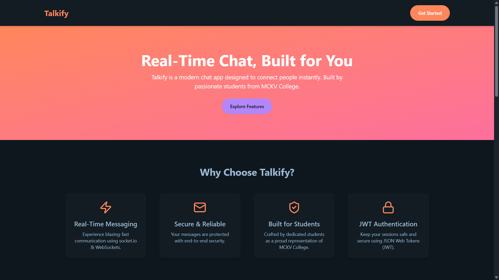
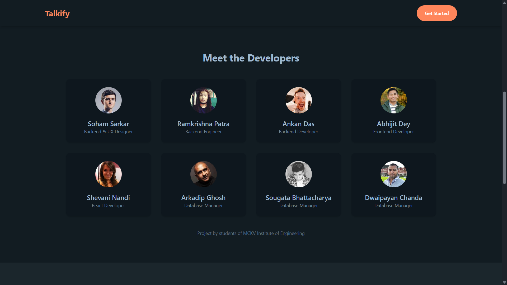
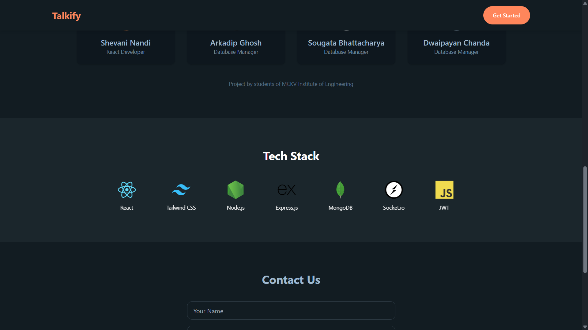
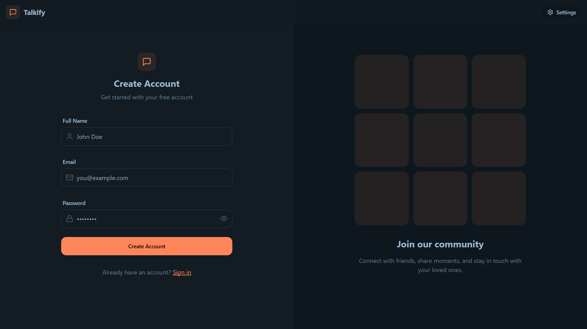
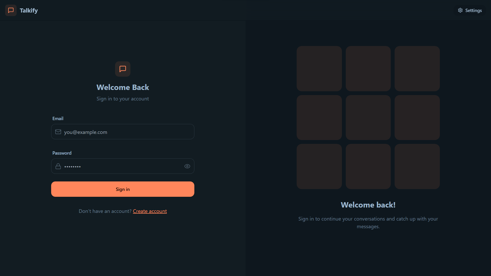
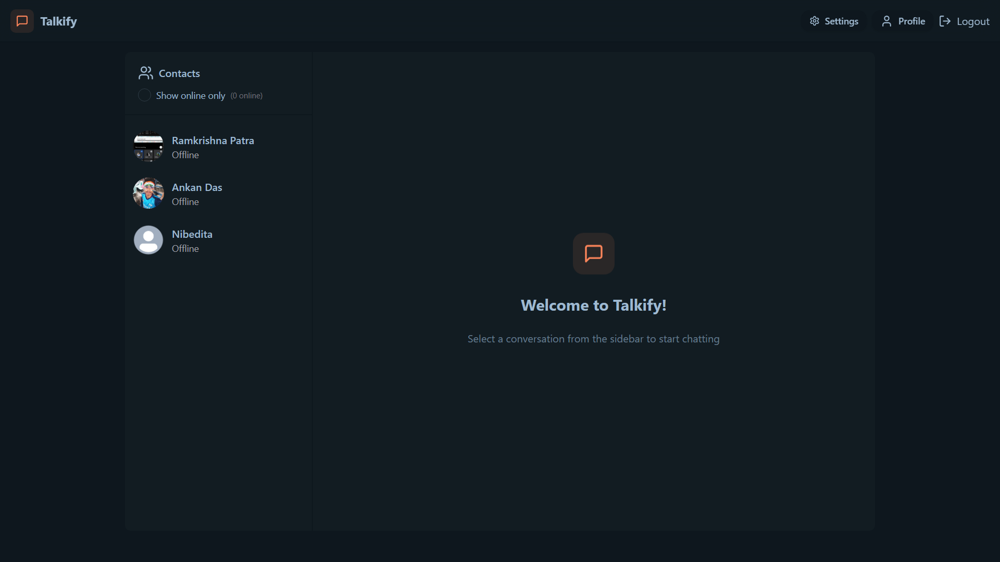
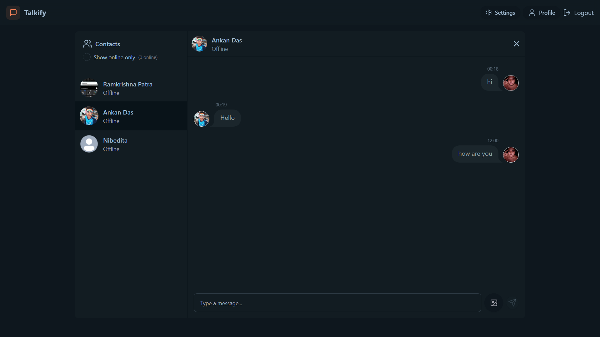
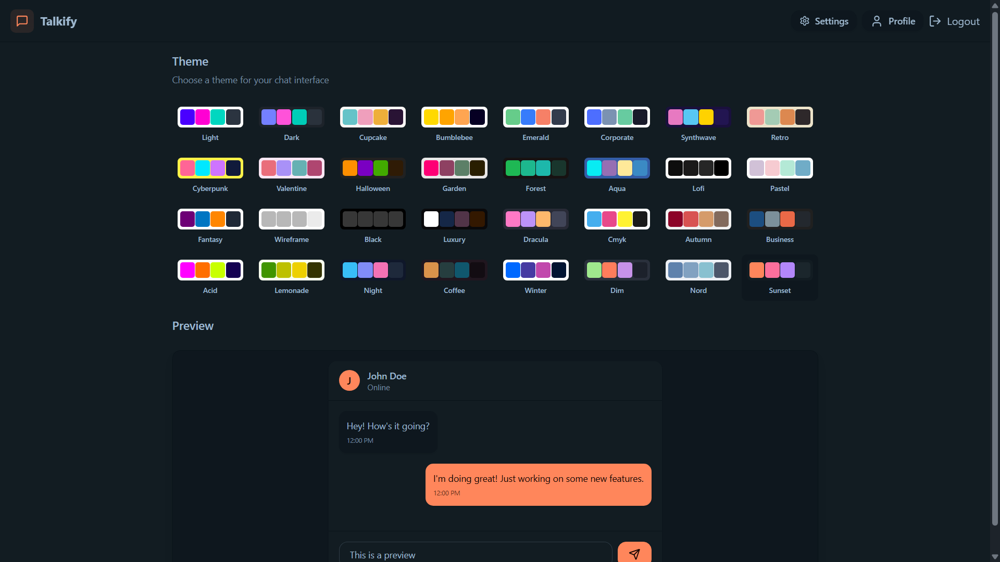

# 🗨️ Talkify - Real-Time Chat Application

> 🚀 Internship Project @ **Ardent Computech Ltd**  
> 📌 Domain: **MERN Full Stack Web Development**

**Talkify** is a real-time, one-on-one chat application built using the MERN Stack with seamless real-time messaging powered by **Socket.IO**. The project focuses on providing a clean and interactive user experience with advanced features like theming, media upload, JWT authentication, and cloud storage.

---

## 🌟 Features

- ⚡ **Real-Time One-to-One Chat** using **Socket.IO**
- 🧑‍🎨 **32 Beautiful Themes** integrated using **DaisyUI**
- 🔐 **JWT Authentication** for secure login and session handling
- ☁️ **MongoDB Atlas** for scalable cloud-based database
- 📷 **Image Uploads** up to **10MB** (Stored via **Cloudinary**)
- ⏰ **Timestamps** for each message
- 🌈 **Interactive UI** and **Error/Success Toasts** using **React-Toastify**
- 📱 Fully Responsive Design (Mobile-First)
  
---

## 🔗 Live Demo
🚀 Check out the live app here: [Talkify – Live Chat App](https://talkify-pvdl.onrender.com/)

---

## 🛠️ Tech Stack

| Frontend          | Backend              | Realtime        | Storage / DB     | UI & UX             |
|-------------------|----------------------|------------------|------------------|---------------------|
| React.js          | Node.js + Express.js | Socket.IO        | MongoDB Atlas    | Tailwind CSS + DaisyUI |
| React-Router      | JWT Auth Middleware  |                  | Cloudinary       | React-Toastify        |

---

## 📸 Screenshots

### 🏠 Hero Section

### 👨‍💻 Developers Section

### 🧱 Tech Stack Display

### 📝 Signup Page

### 🔐 Login Page

### 💬 Home - Chat Interface

### ⚙️ Settings Page

